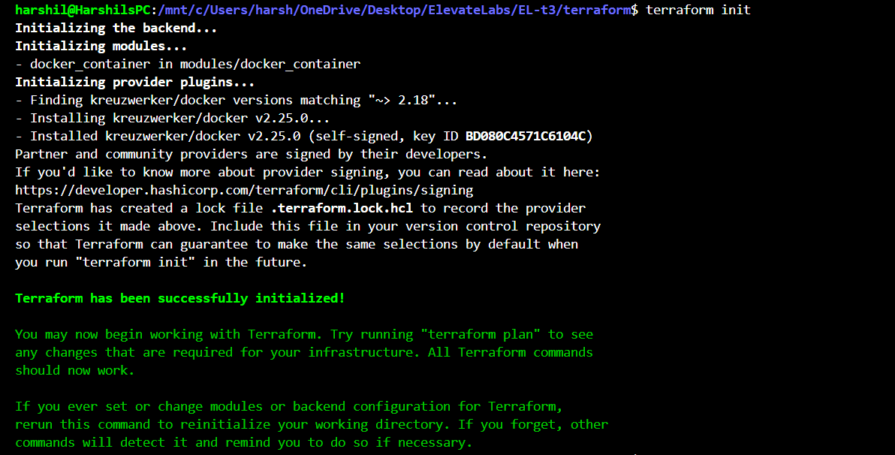
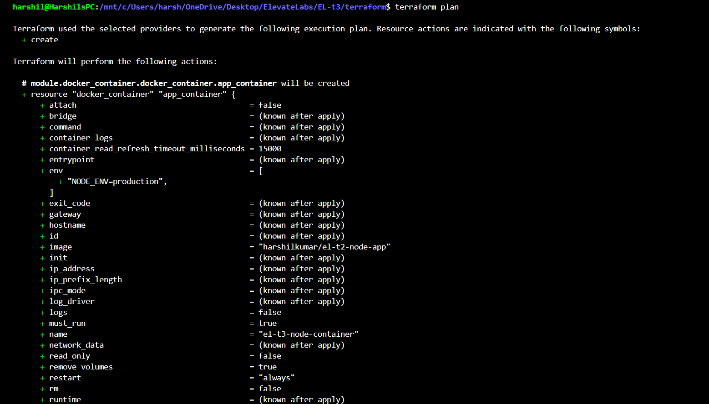
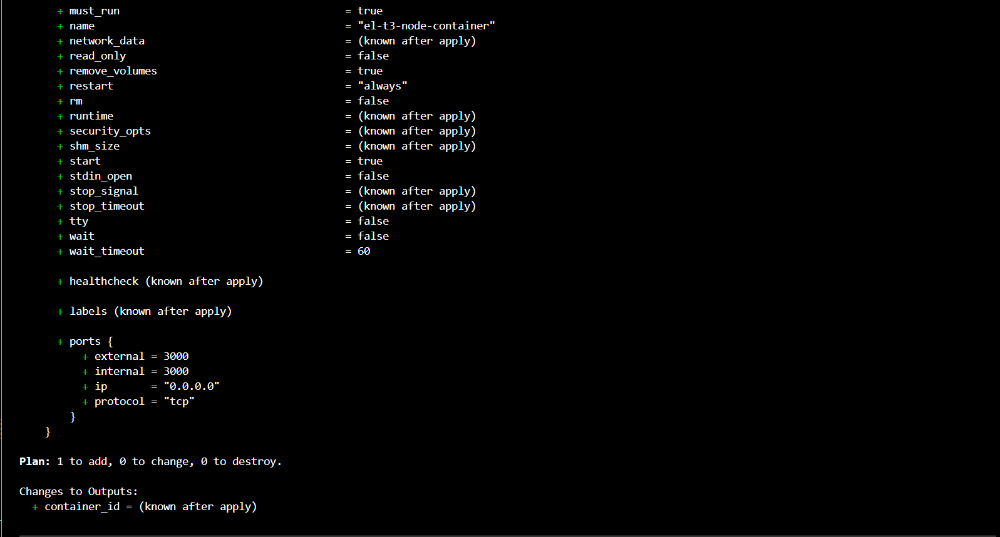
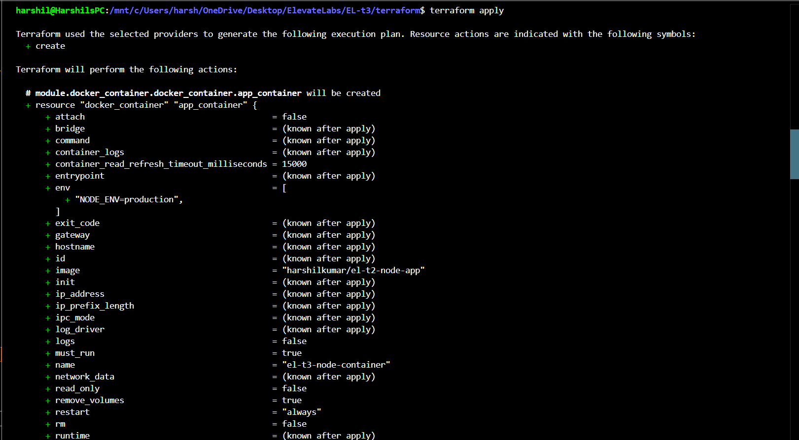
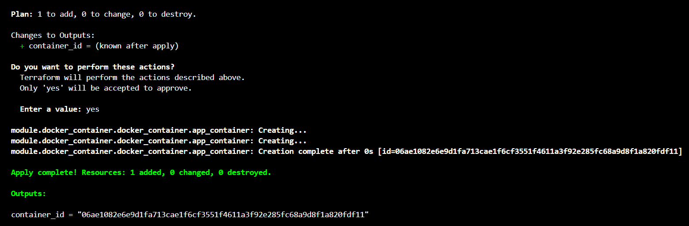
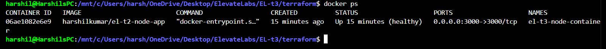
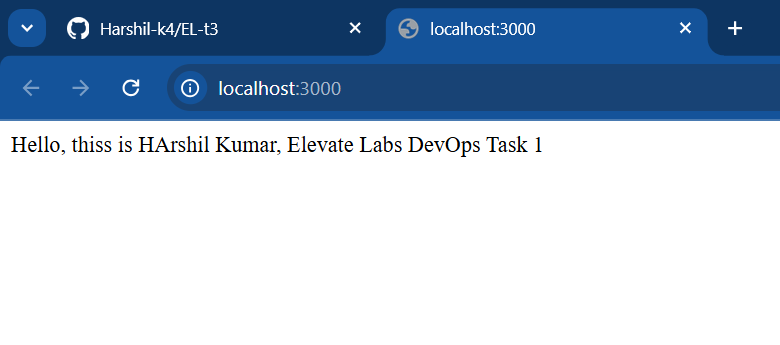
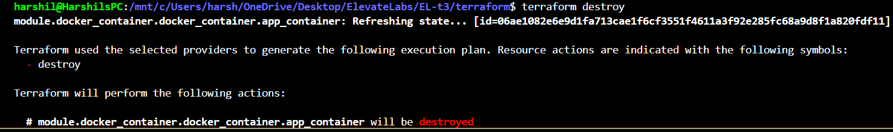
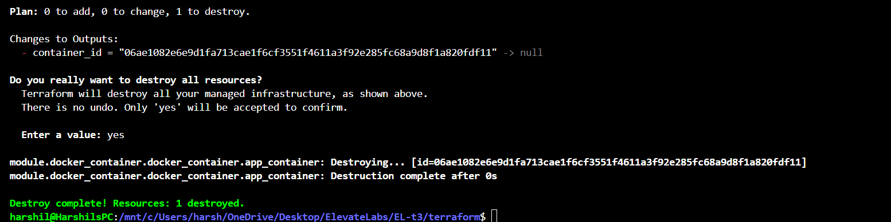
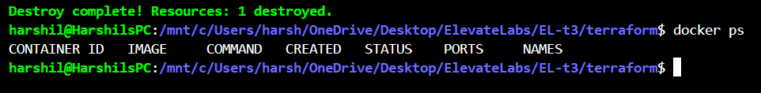

# Terraform Infrastructure as Code (IaC) for Local Docker Container Deployment

## Project Overview

This project demonstrates how to provision a local Docker container using Terraform by leveraging the Docker provider. The container runs a Node.js application using a publicly available Docker image (`harshilkumar/el-t2-node-app`) from Docker Hub. The setup avoids building the Docker image locally to simplify deployment and prevent path-related issues.

## Objectives

- Use Terraform to manage local Docker resources declaratively.
- Deploy a Docker container running the Node.js app from a public Docker Hub image.
- Practice core Terraform commands: `init`, `plan`, `apply`, `destroy`, and inspecting state.
- Learn about Terraform Docker provider configuration and modular architecture.

## Prerequisites

- Docker installed and Docker daemon running locally.
- Terraform installed (version 1.1.0 or higher recommended).
- Network access to pull the public Docker image from Docker Hub.

## Directory Structure

EL-t3/ 
├── Dockerfile (for simplification and best pratice im using the docker image from the dockerhub registry) 
├── package-lock.json 
├── package.json 
├── src/ 
│ └── index.js (Node.js app source) 
└── terraform/ 
├── main.tf (root Terraform configuration) 
├── variables.tf (root variables) 
├── outputs.tf (root outputs) 
└── modules/ 
└── docker_container/ 
├── main.tf (module's Docker container resource) 
├── variables.tf (module variables) 
├── outputs.tf (module outputs) 
└── providers.tf (module provider declaration) 

## Description of Steps Followed

1. **Initial Exploration and Dockerfile Issues**

   - Attempted to build the Docker image locally with Terraform using the existing `Dockerfile`.
   - Faced path resolution errors due to relative paths and multi-level nesting of Terraform modules.
   - Explained how Terraform resolves paths relative to the root module directory (where `terraform apply` is run).
   - Tried to fix relative path issues by adjusting the number of `../` levels, but errors persisted.

2. **Decision to Use Public Docker Hub Image**

   - To avoid complexities with build contexts and file path errors, transitioned to use an already published public Docker image: `harshilkumar/el-t2-node-app`.
   - This simplifies Terraform code by pulling the image directly from Docker Hub, skipping local image build.
   - Updated Terraform module and root configurations accordingly.

3. **Terraform Code Structure and Provider Setup**

   - Defined provider in `terraform/main.tf`, specifying `kreuzwerker/docker` as the source.
   - Modularized the container definition in `terraform/modules/docker_container/` with clearly structured variables, outputs, and resources.
   - Passed the Docker provider explicitly from root module to child module to avoid provider source mismatch errors.

4. **Terraform Workflow and Commands**

   - Cleaned up previous Terraform state and plugins with `rm -rf .terraform` to avoid stale cache issues.
   - Ran `terraform init` to initialize Terraform providers and modules.
   - Used `terraform plan` to review intended changes before applying.
   - Executed `terraform apply` to create Docker container. Confirmed the container creation with output of Docker container ID.
   - Verified locally with `docker ps` that the container named `el-t3-node-container` was running and healthy, with port 3000 mapped to host.

5. **Outputs and State Management**

   - Configured module and root outputs to display container IDs after deployment.
   - Planned to add screenshots or images of the current Terraform state and Docker container status post-deployment.
   - Prepared for follow-up cleanup steps using `terraform destroy` to remove the container.

## Sample Terraform Commands Used & Logs (Reference)

**Initialize Terraform:**

terraform init

*Output snippet:* Terraform initializes Docker provider `kreuzwerker/docker@v2.25.0`.

**Plan Infrastructure:**  

terraform plan

*Output snippet:* Terraform plans to create one Docker container resource using image `harshilkumar/el-t2-node-app`, mapping port 3000.

**Apply Configuration:**  

terraform apply

*Confirmed with `yes` to create the container.*

*Output snippet:* Container `el-t3-node-container` created successfully. Outputted container ID.

**Verify Container Running:**  

docker ps

*Output shows the container running healthy with ports mapped correctly.*

## What Will Happen on Destroy

When you run:

terraform destroy

Terraform will remove the Docker container it created (`el-t3-node-container`) and clean up resources managed by Terraform. This is important to avoid orphaned containers and free system resources. You will be prompted to confirm destruction.

## Summary

- This setup leverages Terraform's Docker provider to provision and manage Docker containers locally as code.
- Using a public Docker image avoids local build context complexity and common relative path errors.
- The modular Terraform code structure helps maintain clear separation of concerns and provider management.
- Following the validated workflow (`init` → `plan` → `apply` → `state check` → `destroy`) ensures safe and repeatable infrastructure management.
- The container runs your Node.js app locally, accessible at `http://localhost:3000`.